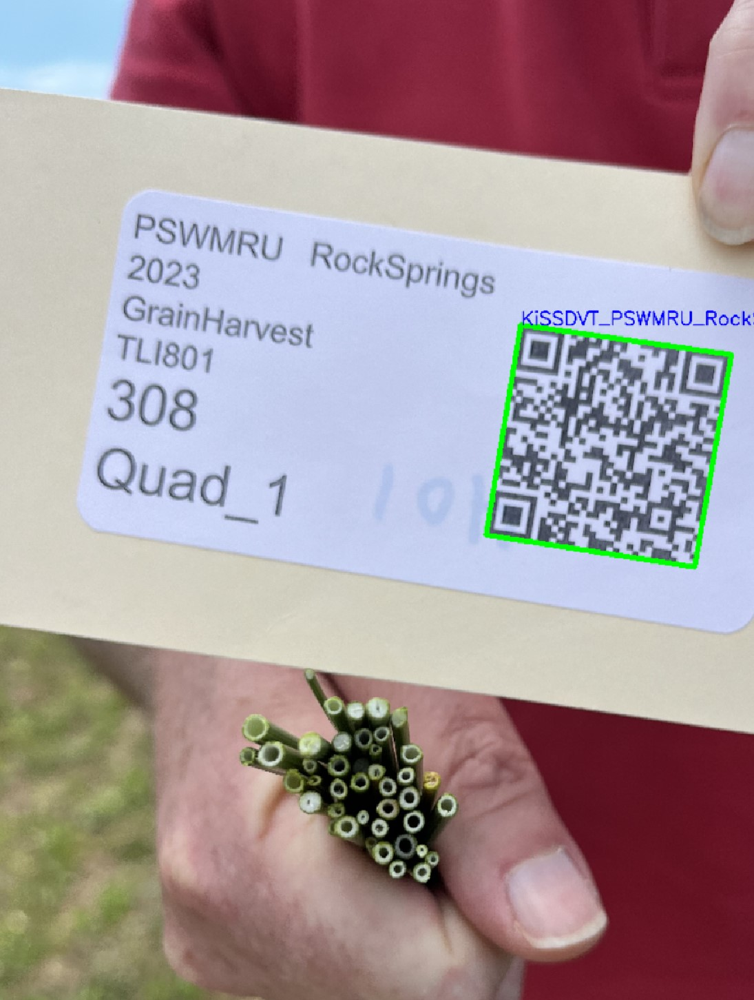

# Read QR code

## Description
This is a simple python script that reads a QR code from an image and prints the result.
It uses the WeChat QR code reader API in openCV to read the QR code from a CV2 image.

## Installation
1. Install using pip:
```shell
pip install readQR
```

## Usage
```python
from readQR import readQR
import cv2

img = cv2.imread('test.png')
reader = readQR()
show = None # Set to "single" or "continuous" to show the image with the QR code highlighted for single or continuous frames (video)
result = reader.decode(img, show=show)
[print(r) for r in result]
```
##  Sample input and output images

### Input images

 

### Output images
 

## Contributing
Pull requests are welcome. For major changes, please open an issue first to discuss what you would like to change.

## License
None